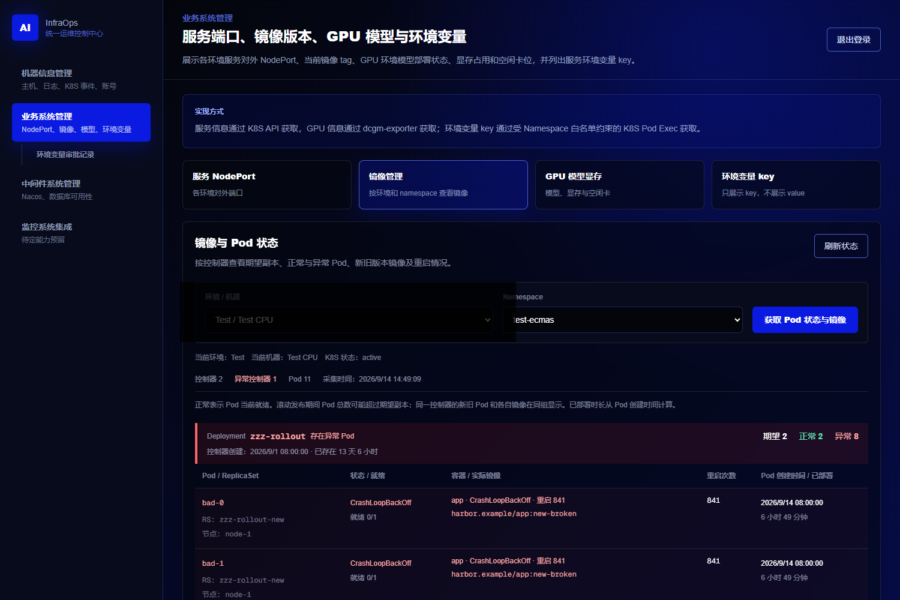
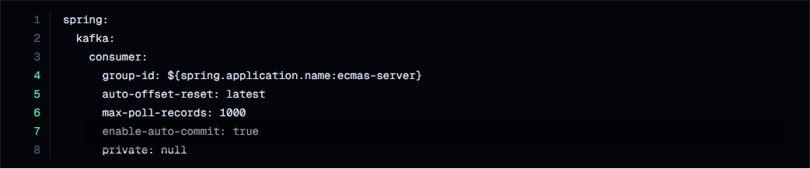
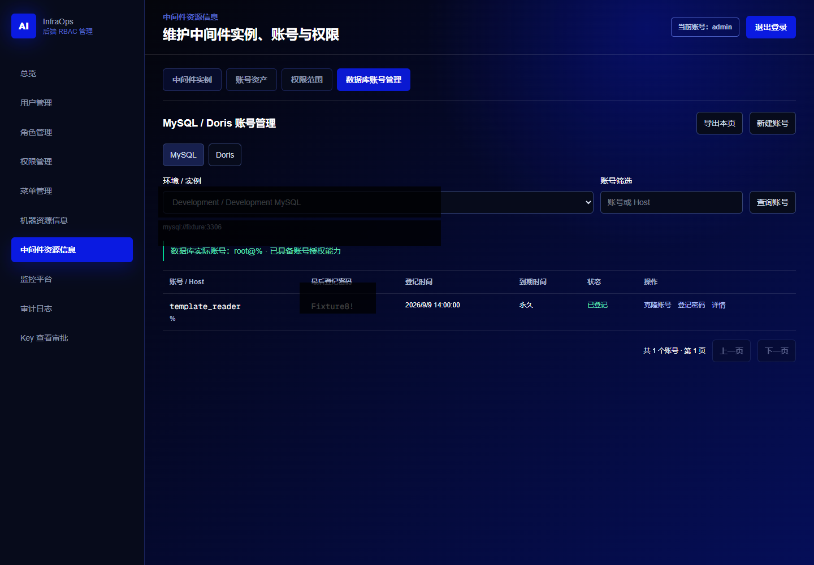
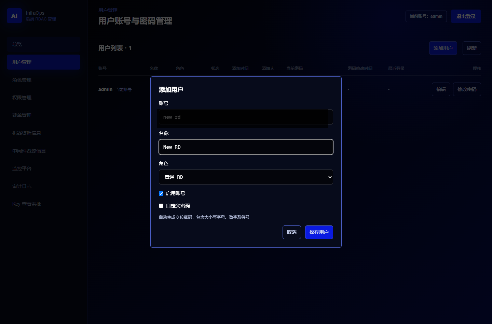
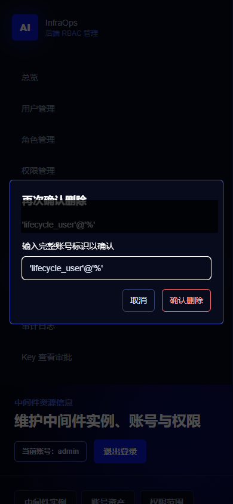

# AI InfraOps

AI InfraOps 是一个面向统一运维的长期项目，目标是把集群、用户、权限、中间件、数据链路、告警和可观测性整合到一个平台里。

## 主要功能

### 用户端（3000）

- **机器信息管理**：查看环境 API、机器账号和中间件账号入口。
- **业务系统管理**：查询服务 NodePort、K8S Pod 状态与实际镜像、GPU 模型显存、环境变量 Key。
- **异常 Pod 聚合**：按 Deployment、StatefulSet 和 DaemonSet 聚合；异常控制器置顶标红，同时保留正常旧 Pod。摘要显示期望、正常、异常数量；每组默认最多展示 5 个 Pod，其余分页查看。
- **环境变量 Value 审批**：研发只能看到 Key，提交申请后由管理员审批，审批快照保存采集时间并按用户隔离。
- **中间件系统管理**：查看 Nacos Namespace、Group、DataId 和脱敏配置结构；Nacos Value 按页面行号申请，审批通过后用带行号的连续配置块展示。
- **审批记录**：用户只能查看自己的申请和历史快照；审批编号是环境变量与 Nacos 共用的全局自增 ID，可能跳号。

### 后台管理端（3001）

- **RBAC 管理**：管理用户、角色、权限、菜单、主机和审计日志。
- **用户管理**：仅超级管理员 `admin` 可新增和编辑用户。支持普通 RD、超级管理员、自动生成或自定义密码；新用户显示添加时间和添加人，自动生成密码只在后台 admin 页面明文显示。
- **中间件资源信息**：登记和维护 Nacos、MySQL、Doris 等连接信息，凭证使用 AES-GCM 加密保存。
- **MySQL / Doris 账号管理**：查看账号和原生密码有效期，创建账号时默认所有库表只读，也可选择所有库表读写或逐库逐表混合权限；支持创建、修改、删除库表及临时表权限。
- **账号权限维护**：已创建账号的权限默认折叠，可展开查看，新增、撤销、升级或降级库表权限。
- **账号生命周期**：禁用和删除均需两次确认。操作完成后回查数据库；网络中断时显示待核验，不把未知结果当作成功。

## 页面示例

以下截图均为本地验收生成的脱敏演示图，只使用 fixture/mock 数据，不代表任何真实环境配置。

### K8S Pod 状态与镜像

异常控制器置顶，正常旧 Pod 和异常新 Pod 在同一个控制器下展示；实际镜像、状态、重启次数和创建时间均来自 K8S API。



### Nacos 审批配置快照

审批快照以连续配置块展示，左侧为原文行号；未获批的值保留脱敏占位。



### 数据库账号管理

账号列表展示最后登记密码和密码有效期；库表权限默认折叠，创建账号支持默认全库权限或特殊库表权限。



### 用户新增与账号操作确认

后台 admin 可以新增 RD 或超级管理员，并使用二次确认保护禁用、删除等高风险操作。





## 使用说明

1. 先初始化平台数据库并启动 FastAPI，再分别启动 3000 用户端和 3001 后台端。
2. 使用后台 `admin` 登录，在“机器信息管理”配置 K8S 凭证，在“中间件资源信息”登记 Nacos、MySQL、Doris 连接。
3. 用户端选择环境和 Namespace 后手动查询资源；镜像页点击“获取 Pod 状态与镜像”，后续可用右上角“刷新状态”。
4. Nacos 查看内容后，按结构页左侧行号申请。例如连续区间使用 `18-26`，多个区间使用 `18-26，36-57`。绿色行号表示可申请的独立值，灰色行号表示层级或容器结构。
5. 数据库账号管理中，默认创建范围是所有库表只读。需要混合权限时切换特殊库表权限，逐库选择“全部表”或展开选择具体表，再分别选择只读或读写。

所有外部写操作都显示明确结果并执行回查。数据库账号创建、权限编辑、禁用和删除均有操作编号；结果不确定时先查询原操作，不要换新编号重复执行。

## 隐私与凭证安全

- README 和 `md-assets` 中只使用脱敏或 mock 截图；禁止放入真实 IP、端口、账号、密码、Token、kubeconfig、Nacos 内容或数据库连接串。
- 平台凭证在服务端使用 AES-GCM 加密，浏览器仅保存短期 opaque session token；接口响应设置禁止缓存。
- 用户端不返回环境变量 Value、Nacos 全文 Value、数据库管理地址或中间件密码。数据库账号密码明文仅允许后台超级管理员 `admin` 查看，并且只在明确操作后返回。
- 测试使用独立 mock 库、表、账号和角色，测试结束必须清理；生产和预生产只做明确授权的只读检查。

## 当前状态

- `apps/admin-web`：普通用户控制台，登录页和动态菜单已接入 FastAPI RBAC；研发只显示业务系统和中间件系统，运维可查看全部功能。
- `apps/backend-admin-web`：后端 RBAC 管理页面，运行在 `3001` 端口；维护环境主机、K8S 凭证和中间件连接信息，并提供安全审计日志。
- `apps/user-web`：预留给普通用户门户。
- `services/backend`：FastAPI + MySQL 后端，当前覆盖 RBAC、机器资源、环境主机、K8S 凭证、Running Pod 镜像与环境变量 Key 查询、Nacos 配置目录以及 Doris/MySQL 账号查询。
- `services/linux-agent`：部署到 Linux 主机的只读 Go Agent，提供本地账号清单与数量，不读取密码哈希。
- `services`：后续可以按语言和领域继续拆分服务。
- `docs`：记录架构、vibecoding 过程、参考项目和知识点。
- `md-assets`：只放 Markdown 文档引用的截图、设计图和静态图片。
- `infra`：预留 Docker、K8S、Helm、Compose 等部署和基础设施配置。
- `packages`：预留前后端共享类型、公共 UI、统一配置等可复用包。
- `scripts`：项目级开发、代码生成、迁移、运维脚本入口；具体服务自己的脚本放在各自服务目录下，例如 `services/backend/scripts/init_mysql.py`。

监控平台入口使用独立 `monitoring_platforms` 表维护。3001 后台负责添加、编辑、启停、排序和连通性检测；3000 用户端仅获取已启用平台的名称、类型、说明和跳转 URL。第三方监控数据、登录态和账号密码不进入本项目，实现与 Backstage、Grafana 等平台解耦。

## 本地运行

启动后台管理前端：

```powershell
npm run dev:admin
```

启动后端 RBAC 管理页面：

```powershell
npm run dev:backend-admin
```

初始化 MySQL：

```powershell
cd services/backend
micromamba run -n base python scripts/init_mysql.py
```

启动 FastAPI 后端：

```powershell
cd services/backend
micromamba run -n base python -m uvicorn app.main:app --host 0.0.0.0 --port 8000 --reload
```

等价于：

```powershell
cd apps/admin-web
npm run dev
```

访问：

```text
http://localhost:3000
http://localhost:3001
http://localhost:8000/health
```

三个服务均监听 `0.0.0.0`。本机继续使用上述地址访问；局域网内其他设备使用运行本项目的 Windows 主机 IP，例如 `http://<本机IP>:3000` 和 `http://<本机IP>:3001`。浏览器统一请求前端同源的 `/api/*`，再由 Next.js 在本机反向代理到 `127.0.0.1:8000`，因此局域网客户端不需要直接访问 8000，也不会受到 Python 入站防火墙规则或 CORS 影响。Next.js 开发服务会在启动时把本机所有非回环 IPv4 地址加入 `allowedDevOrigins`；Wi-Fi 地址发生变化后需要重启两个前端。若外部设备无法连接，只需检查 Windows 防火墙中的 `3000`、`3001` TCP 入站端口。

## 根命令说明

这些命令定义在最外层 `package.json`，统一从项目根目录执行：

```text
npm run dev:admin          启动普通用户控制台，端口 3000
npm run build:admin        构建普通用户控制台
npm run lint:admin         检查普通用户控制台代码

npm run dev:backend-admin  启动后端 RBAC 管理页面，端口 3001
npm run build:backend-admin 构建后端 RBAC 管理页面
npm run lint:backend-admin 检查后端 RBAC 管理页面代码

npm run dev:rbac-api       启动 FastAPI RBAC 后端，端口 8000
npm run init:mysql         执行 MySQL 初始化 SQL，创建 RBAC 库表和初始 admin 账号
```

## 脚本目录说明

```text
scripts/
  README.md                项目级脚本目录说明。后续放跨应用、跨服务的通用脚本。

services/backend/scripts/
  init_mysql.py            读取根目录 .env，连接 MySQL，执行 init.sql 及编号迁移 SQL。
  check_nacos_catalog.py   使用首个已登记 Nacos 做目录冒烟检查，只输出实例、Namespace、配置和格式数量。
```

## 机器资源信息

当前第一版通过 node-exporter 获取主机指标：

```text
GET    /api/hosts                 查看主机列表和最近一次探测状态
POST   /api/hosts                 添加主机，同时记录环境和可选 kubeconfig 文本
PUT    /api/hosts/{host_id}       更新已有主机；凭证留空时保留原值
POST   /api/hosts/{host_id}/probe 重新检测 node-exporter 并更新连接原因
DELETE /api/hosts/{host_id}       删除主机
GET    /api/hosts/{host_id}/metrics 查看 CPU 使用率、内存使用率、/ 目录磁盘使用率及对应容量详情
GET    /api/resources/hosts         用户端查看可查询的集群或独立主机入口
GET    /api/resources/hosts/{host_id}/metrics 用户端查询整个 K8S 集群或独立主机资源
GET    /api/linux-accounts/hosts              用户端查看已配置账号 Agent 的主机
GET    /api/linux-accounts/hosts/{host_id}    实时查询指定主机的本地账号清单
```

node-exporter 可以稳定提供 CPU 累计时间、CPU 核数、内存、磁盘、系统内核和 `node_uname_info` 里的 nodename。CPU 使用率当前通过短间隔采样 `node_cpu_seconds_total`，按非 idle 时间占比计算；内存和磁盘使用率按已用/总量计算。公网 IP 当前从填写的 exporter URL 推断；私网 IP 不建议依赖 node-exporter 自动识别，后台添加主机时保留手动填写字段。

用户端“集群与主机资源”会判断主机是否绑定 K8S 凭证：有凭证时通过 K8S Service Proxy 自动发现 Prometheus，实时查询整个集群所有 Node 的最近 5 分钟 CPU 使用率、内存和根目录容量；无凭证时回退到该主机的 node-exporter。单节点 K8S 返回一项，多节点返回全部节点，缺少指标的节点仍会展示并标明原因。详细设计见 `docs/vibecoding/k8s-node-resource-inventory.md`。

FastAPI 会将请求耗时、请求 ID、主机探测和异常写入 `.local/logs/backend.log`，并按文件大小自动滚动。后台管理页面直接展示 `last_error` 中的连接失败原因，并提供“重新检测”操作；日志不会记录请求体、密码和 kubeconfig。

后台主机表单可以选填“主机用户管理地址”。普通用户端按环境和主机查询时，FastAPI 使用仅保存在 `.env` 的 Bearer Token 调用 Go Agent；浏览器不会获得 Agent 地址或 Token。当前只读取 `/etc/passwd`，详细边界见 `docs/vibecoding/linux-account-agent.md`。

## K8S 镜像查询

数据关系为“环境 → 主机 → K8S 凭证”，凭证记录通过唯一 `host_id` 绑定主机，镜像不缓存到 MySQL。用户端只加载已配置凭证的环境主机，选择 namespace 并点击按钮后，FastAPI 实时读取 Running Pod，并按 Deployment、StatefulSet、DaemonSet 返回 Pod 名称、副本数和每个容器的完整镜像。

```text
GET    /api/k8s/hosts                         查看已配置 K8S 凭证的环境主机
GET    /api/k8s/namespaces?host_id=...        实时读取 namespace
GET    /api/k8s/images?host_id=...&namespace=... 实时读取 Running Pod 镜像
```

3001 页面不提供独立集群表单，只在统一主机表单中提供“K8S 凭证内容”输入栏。后端使用 AES-256-GCM 加密 kubeconfig 后把密文、随机 nonce 和指纹存入 MySQL，并绑定对应主机；主密钥只存在根目录 `.env`。详细设计与操作见 `docs/vibecoding/k8s-image-inventory.md`。

## K8S 环境变量 Key 查询

后台主机表单通过 `Namespace Key 白名单` 配置允许普通用户查询的 Namespace。用户端按“所属环境 → Namespace → Deployment/StatefulSet”选择工作负载，后端从其 Running Pod 中选择一个副本，并分别返回每个普通容器的环境变量名称。

```text
GET /api/k8s/env/hosts
GET /api/k8s/env/namespaces?host_id=...
GET /api/k8s/env/workloads?host_id=...&namespace=...
GET /api/k8s/env/keys?host_id=...&namespace=...&kind=...&workload=...
```

以上接口要求 `user_web` Bearer 会话和 `k8s:env:list` 权限。Namespace 白名单在每层 API 服务端重新校验，容器内命令只输出 Key，FastAPI 不接收 value。完整设计见 `docs/vibecoding/k8s-env-key-inventory.md`。

KubeKey kubeconfig 将 API Server 域名替换为外部可达 IP 后，如果证书不包含该 IP，应在同一个 cluster 配置中保留 `certificate-authority-data` 并设置 `tls-server-name` 为证书内的原域名。仅在受信网络临时排障时使用 `insecure-skip-tls-verify: true`；平台会遵循这两个 kubeconfig 字段。

## Nacos 连接信息

后台管理页面的“中间件资源信息 → 中间件实例”提供所属环境、Nacos URL、用户名和密码四个字段。环境复用 `infra_environments`，连接记录保存到 `middleware_instances`；密码使用 AES-256-GCM 加密，列表接口不会查询或返回密码密文。

```text
GET    /api/middleware/instances              查看已登记的中间件实例
POST   /api/middleware/instances              添加 Nacos、Doris 或 MySQL 连接信息
PUT    /api/middleware/instances/{instance_id} 修改连接信息；密码留空时保留原凭证
DELETE /api/middleware/instances/{instance_id} 删除连接信息
GET    /api/nacos/instances                   用户端获取已登记的 Nacos 环境
GET    /api/nacos/instances/{instance_id}/catalog 实时读取 Namespace、Group、DataId 和格式
```

目录接口使用 `user_web` Bearer 会话和 `nacos:catalog:list` 权限。FastAPI 只映射 Nacos 元数据接口中的 Namespace、Group、DataId 和格式，显式丢弃 `content`、MD5 等其他字段；不会把 URL、用户名、密码或配置正文返回浏览器。详细边界见 `docs/vibecoding/nacos-connection-management.md`。

## Doris 账号信息

后台在同一个中间件实例表单中切换到 Doris，登记所属环境、实例名称、FE Host、查询端口、管理用户名和密码。密码沿用中间件 AES-256-GCM 加密机制，用户端只获取环境和实例选项。

```text
GET /api/doris/instances
GET /api/doris/instances/{instance_id}/accounts
```

账号接口通过 Doris FE 的 MySQL 协议执行 `SHOW ALL GRANTS`，要求登记账号具有查看全部用户授权的 `GRANT_PRIV`。响应只保留用户标识、Host、备注、角色和授权范围，明确丢弃 `Password` 列；Doris 密码不可逆，也不会返回密码或密码哈希。完整边界见 `docs/vibecoding/doris-account-inventory.md`。

## MySQL 实例与账号

后台中间件实例表单支持登记所属环境、实例名称、MySQL Host、连接端口、管理用户名、管理密码和 Grafana 仪表盘地址。已登记实例可进入编辑模式并回填原属性；密码不会回显，编辑时留空即保留原加密凭证。

普通用户端的“中间件账号获取”可以切换 Doris/MySQL，按所属环境和实例实时查询 MySQL 用户标识、Host、认证插件和账号状态。超级管理员还可加密登记当前密码、显示/复制、通过目标账号登录校验，并通过登记管理账号执行 `ALTER USER` 同步密码。中间件系统页面会列出已登记的 Grafana 仪表盘超链接，点击后在新窗口打开；该只读接口不返回 MySQL 连接地址、管理用户名或凭证。详细边界见 `docs/vibecoding/mysql-instance-management.md`。

## 普通用户控制台功能骨架

当前 `apps/admin-web` 登录后左侧功能栏先搭静态页面，后续按模块逐步接入真实 API：

```text
机器信息管理       环境 API 地址、机器账号列表、中间件账号获取
业务系统管理       服务 NodePort、镜像 tag、GPU 模型显存、环境变量 key
中间件系统管理     Nacos 配置目录、MySQL/Doris/Redis/Kafka 可用性快速校验
监控系统集成       Prometheus、Loki、告警中心、SLO 守护等入口预留
```

静态页面示例数据只使用占位 IP、占位 API 路径和脱敏密码，不记录真实环境 IP、端口、账号或密码。详细编码记录见 `docs/vibecoding/user-console-static-modules.md`。

## 登录会话

当前登录会话由 FastAPI 写入 Redis。3000 普通用户控制台和 3001 后端管理页面使用不同 `client_type`，因此两边登录态互不覆盖：

```text
user_web            3000 普通用户控制台
backend_admin_web   3001 后端管理页面
```

浏览器端只在当前标签页的 `sessionStorage` 中保存 opaque token，不保存用户名和密码。不同标签页可以分别登录 `admin`、`jiangjun` 等不同账号，关闭标签页后该标签页不再保留本地登录态；服务端 Redis 中的各 token 相互独立。

相关环境变量放在仓库根目录 `.env`，该文件已被 `.gitignore` 忽略：

```text
REDIS_HOST
REDIS_PORT
REDIS_PASSWORD
REDIS_DB
REDIS_TLS
SESSION_TTL_SECONDS
```

## 目录约定

```text
apps/
  admin-web/        普通用户控制台
  backend-admin-web/ 后端 RBAC 管理页面
  user-web/         普通用户使用的门户

services/
  backend/          FastAPI + MySQL 后端，第一阶段只做 RBAC
  api-gateway/      统一 API 网关
  auth-service/     认证、用户、角色、权限
  python-ops-api/   Python 自动化、数据处理、AI/脚本 API
  k8s-service/      Kubernetes API 集成
  middleware-service/ 中间件用户、权限和资源发现

packages/
  shared-types/     前后端共享类型和 DTO
  ui/               前端共用 UI 组件
  eslint-config/    统一 lint 配置
  tsconfig/         统一 TypeScript 配置

docs/
  architecture/     架构设计
  references/       外部开源项目、文章、知识点
  vibecoding/       vibecoding 过程记录

md-assets/          Markdown 引用图片
infra/              Docker、K8S、Helm、Compose
scripts/            开发、代码生成、运维脚本
```

## 前辈经验

本节用于记录 vibecoding 过程中参考过的公开项目、设计作品、框架文档和知识点。记录原则：

- 只记录公开来源、通用技术思路和可复用设计方法。
- 不记录任何真实环境 IP、端口、账号、密码、内网域名或生产拓扑。
- 如果后续参考了开源项目代码，需要补充许可证、仓库地址和具体借鉴范围。
- 如果只是 UI 风格、交互方式或架构思想参考，也要明确写成“灵感参考”，避免误认为直接复制代码。

当前参考记录：

| 类型 | 来源 | 借鉴范围 | 备注 |
| --- | --- | --- | --- |
| UI 灵感 | Dribbble: Jet login screen | 登录页的深色视觉、左侧登录表单与右侧科技感插画氛围 | 仅作视觉方向参考，未复制源文件 |
| 前端框架 | Next.js 官方文档 | `apps/admin-web`、`apps/backend-admin-web` 的应用结构、开发/构建方式 | 用于本地 demo 和后续前端工作区 |
| 前端样式 | Tailwind CSS 官方文档 | 页面布局、响应式栅格、深色控制台样式 | 当前主要用于快速搭建界面 |
| 后端框架 | FastAPI 官方文档 | 登录、RBAC、机器资源信息等 API 的组织方式 | 第一阶段 Python 后端选型 |
| 数据库 | MySQL 官方能力与常见 RBAC 设计 | 用户、角色、权限、菜单、主机信息等关系表建模 | 当前只做基础关系模型 |
| 会话管理 | Redis 常见 session 设计 | 按 `client_type` 隔离 3000 用户端与 3001 管理端会话 | 当前保存 opaque token 会话 |
| 运维指标 | Prometheus node-exporter 指标模型 | CPU、内存、磁盘、主机名、连通状态等指标采集思路 | 当前通过 node-exporter URL 采集 |
| Kubernetes API | [Pod Exec API](https://kubernetes.io/docs/reference/kubernetes-api/core/pod-v1/#connect-exec) | 通过 Pod `exec` 子资源在指定容器中执行 Key-only 命令 | 仅允许后台白名单 Namespace |
| Python 客户端 | [kubernetes-client/python](https://github.com/kubernetes-client/python) | 使用官方 `stream` 模块调用 Pod Exec WebSocket | 不记录 stdout，不返回 value |
