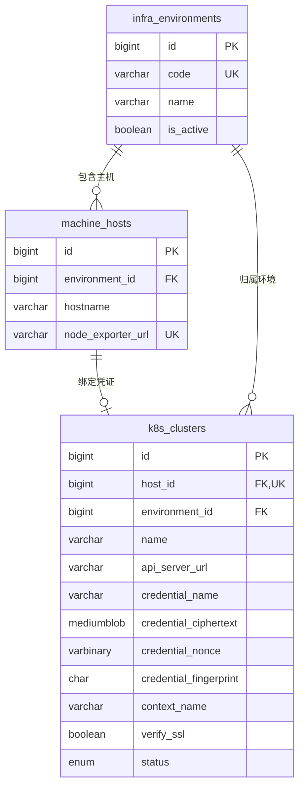

# K8S 镜像与 Pod 状态

更新：2026-09-14

## 目标

普通用户在“业务系统管理 → 镜像管理”选择环境主机和 namespace，手动查询全部 Pod 状态及各自镜像。存在异常 Pod 的控制器默认置顶标红，正常旧 Pod 与异常新 Pod 始终归入同一控制器，避免把滚动发布失败误解为服务全部不可用。

## 数据关系



环境是共享主数据。当前管理流程按“一台已添加主机对应一份 K8S 凭证”建模，`k8s_clusters.host_id` 是唯一外键；同一环境仍可包含多台主机，每台主机可分别维护自己的凭证。

## 查询链路

1. 后台管理人员在同一个表单填写用户自定义的机器名字、环境名称、node-exporter 地址、IP 和可选的 kubeconfig 文本。环境内部编码由后端根据环境名称生成，不作为用户输入项。
2. 后端校验 kubeconfig，使用 AES-256-GCM 加密，并将凭证记录唯一绑定到 `machine_hosts.id`。编辑主机时凭证文本留空表示保留原凭证，提交新内容表示加密覆盖。
3. 用户端调用 `/api/k8s/hosts`，只获取已配置有效凭证的主机及其环境名称，不返回凭证内容。
4. 选择主机后调用 `/api/k8s/namespaces?host_id=...`，FastAPI 在内存中解密对应凭证并请求 K8S API。
5. 点击“获取 Pod 状态与镜像”或区域右上角“刷新状态”后调用 `/api/k8s/images?host_id=...&namespace=...`。刷新期间禁用按钮；切换环境或 namespace 会取消旧查询，旧响应不覆盖新环境。
6. 每次查询仍为同一 namespace 的五个批量列表：Pods、ReplicaSets、Deployments、StatefulSets、DaemonSets，没有按 Pod 追加查询。通过控制器 ownerReference 与 UID 将新旧 ReplicaSet 上溯到同一个 Deployment；名称相同但 UID 不同的重建资源不会误归组。无法解析的 ReplicaSet、独立 Pod 及其他直接控制器保留显示，未知期望副本显示未知。
7. 每个 Pod 返回运行、等待和终止状态，包含初始化容器；优先展示该 Pod 的容器状态镜像，无状态记录时从 Pod spec 补充镜像，不拿控制器新模板覆盖正常旧 Pod 的镜像。字段包括当前错误原因、就绪数量、重启次数、节点、Pod/控制器创建时间。只输出状态原因，不输出可能含敏感信息的错误 message、环境变量或日志。
8. 控制器摘要为期望副本、正常 Pod、异常 Pod；期望来自 Deployment/StatefulSet 的 spec.replicas 或 DaemonSet 的 desiredNumberScheduled，正常/异常数量从实际 Pod 分类累计。启动中、终止中和已完成另计，不能把它们混入健康或故障数量。滚动发布期间 Pod 总数可以超过期望值。

异常包括 CrashLoopBackOff、ImagePullBackOff、ErrImagePull 等等待错误、非零退出、Failed/Unknown、Unschedulable，以及 Running 但未就绪的 Pod。正常表示当前 Ready；历史重启或上次 OOM 不会让已恢复就绪的 Pod 持续标红。ContainerCreating/PodInitializing 等启动状态、正常结束和终止中单独标记。

每个控制器默认最多显示五个 Pod。若异常超过五个且仍有正常 Pod，首组保留一个正常 Pod 样例；其余通过组内分页查看，每页仍至多五个，可收起回到首组。所有 Pod 始终保留在查询数据中，不截断异常计数。Pod 已部署时长按创建时间计算，控制器创建时间另行标注。

镜像列表实时读取，不写入 MySQL。后续如需历史版本、变更趋势或回滚记录，再单独增加带采集时间的快照表。

## 凭据约定

根目录 `.env` 配置：

```text
K8S_CONNECT_TIMEOUT_SECONDS=5
K8S_READ_TIMEOUT_SECONDS=20
K8S_CREDENTIAL_ENCRYPTION_KEY=replace-with-base64-encoded-32-byte-key
```

`K8S_CREDENTIAL_ENCRYPTION_KEY` 解码后必须为 32 字节。kubeconfig 明文只在浏览器提交和后端请求处理期间存在；MySQL 使用 `MEDIUMBLOB` 保存 AES-GCM 密文，并同时保存 12 字节随机 nonce 与 SHA-256 指纹。查询时只在 FastAPI 进程内存中解密，不生成临时凭证文件。

建议为查询身份配置只读 RBAC，最小覆盖：

```text
namespaces: get, list
pods: get, list
replicasets, deployments, statefulsets, daemonsets (apps): get, list
```

## 数据库迁移

本次状态聚合不新增数据库迁移；已有数据库不要为了此功能重跑初始化脚本。

`services/backend/sql/003_k8s_image_inventory.sql` 会创建环境、集群表，给现有主机表添加可空的环境外键，并补充 RBAC 权限点。`004_encrypt_k8s_credentials.sql` 增加密文、nonce、指纹和文件名字段。`005_bind_k8s_credentials_to_hosts.sql` 增加唯一 `host_id` 外键，并在旧环境只有一台主机和一条凭证记录时自动完成关联。

从项目根目录执行：

```powershell
npm run init:mysql
```

无法唯一判断关系的旧记录不会被迁移脚本强行绑定，可在 3001 页面点击对应主机的“编辑”并重新提交凭证完成绑定。

## 本次编码操作

- 安装并使用 Kubernetes Python Client 36.x。
- 按主机读取凭证、namespace 和完整 Pod 镜像/健康状态，前端按控制器聚合并优先显示异常控制器。
- 3001 管理端使用一个完整主机表单，kubeconfig 通过多行输入框粘贴，并支持编辑已添加主机。
- 3000 用户端只显示已配置凭证的环境主机，选择 namespace 后由按钮手动触发真实镜像查询。
- 增加加载、空数据、连接失败、凭证保留和手动查询状态。
- kubeconfig 使用 AES-256-GCM 加密后保存到 MySQL，主密钥、真实地址和认证信息不写入源码、Markdown 或 Git。

验证覆盖新旧 ReplicaSet 合并、UID 不匹配、启动失败、init 容器异常、缺失容器状态、恢复后的重启、就绪状态、200 个异常 Pod 不丢失数据。浏览器验证异常置顶、五条分页、保留正常样例、刷新及窄屏布局；易储测试环境通过现有 K8S API 只读核对，未修改集群对象。
