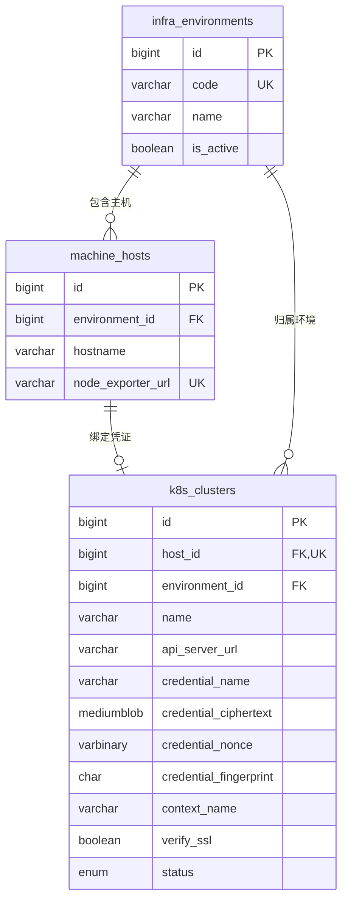

# K8S 镜像 tag 查询

日期：2026-07-29

## 目标

普通用户在“业务系统管理 → 镜像 tag”中选择已配置 K8S 凭证的环境主机和 namespace，点击查询按钮后查看该 namespace 下当前 Running Pod 实际运行的容器镜像、tag 或 digest。

## 数据关系



环境是共享主数据。当前管理流程按“一台已添加主机对应一份 K8S 凭证”建模，`k8s_clusters.host_id` 是唯一外键；同一环境仍可包含多台主机，每台主机可分别维护自己的凭证。

## 查询链路

1. 后台管理人员在同一个表单填写用户自定义的机器名字、环境名称、node-exporter 地址、IP 和可选的 kubeconfig 文本。环境内部编码由后端根据环境名称生成，不作为用户输入项。
2. 后端校验 kubeconfig，使用 AES-256-GCM 加密，并将凭证记录唯一绑定到 `machine_hosts.id`。编辑主机时凭证文本留空表示保留原凭证，提交新内容表示加密覆盖。
3. 用户端调用 `/api/k8s/hosts`，只获取已配置有效凭证的主机及其环境名称，不返回凭证内容。
4. 选择主机后调用 `/api/k8s/namespaces?host_id=...`，FastAPI 在内存中解密对应凭证并请求 K8S API。
5. 选择 namespace 不会自动查询镜像；用户点击“获取当前正在运行的镜像”后调用 `/api/k8s/images?host_id=...&namespace=...`。
6. 后端读取该 namespace 的 Pod，过滤 `status.phase=Running` 且至少一个容器状态为 running 的记录；通过 ownerReference 将 ReplicaSet 上溯为 Deployment，只返回 Deployment、StatefulSet、DaemonSet。
7. 每条记录对应一个实际 Running Pod，返回控制器类型、控制器名称、Pod 名称、控制器就绪/期望副本数，以及这个 Pod 内每个容器的名称和完整镜像；多容器 Pod 保持容器与镜像一一对应。
8. 副本数直接读取控制器状态：Deployment 和 StatefulSet 使用 `status.readyReplicas/spec.replicas`，DaemonSet 使用 `status.numberReady/status.desiredNumberScheduled`，不通过 Pod 数量猜测。

镜像列表实时读取，不写入 MySQL。后续如需历史版本、变更趋势或回滚记录，再单独增加带采集时间的快照表。

## 凭据约定

根目录 `.env` 配置：

```text
K8S_CONNECT_TIMEOUT_SECONDS=5
K8S_READ_TIMEOUT_SECONDS=20
K8S_CREDENTIAL_ENCRYPTION_KEY=replace-with-base64-encoded-32-byte-key
```

`K8S_CREDENTIAL_ENCRYPTION_KEY` 解码后必须为 32 字节。kubeconfig 明文只在浏览器提交和后端请求处理期间存在；MySQL 使用 `MEDIUMBLOB` 保存 AES-GCM 密文，并同时保存 12 字节随机 nonce 与 SHA-256 指纹。查询时只在 FastAPI 进程内存中解密，不生成临时凭证文件。

建议为查询身份配置只读 RBAC，最小覆盖：

```text
namespaces: get, list
pods: get, list
```

## 数据库迁移

`services/backend/sql/003_k8s_image_inventory.sql` 会创建环境、集群表，给现有主机表添加可空的环境外键，并补充 RBAC 权限点。`004_encrypt_k8s_credentials.sql` 增加密文、nonce、指纹和文件名字段。`005_bind_k8s_credentials_to_hosts.sql` 增加唯一 `host_id` 外键，并在旧环境只有一台主机和一条凭证记录时自动完成关联。

从项目根目录执行：

```powershell
npm run init:mysql
```

无法唯一判断关系的旧记录不会被迁移脚本强行绑定，可在 3001 页面点击对应主机的“编辑”并重新提交凭证完成绑定。

## 本次编码操作

- 安装并使用 Kubernetes Python Client 36.x。
- 新增按主机读取凭证、namespace 和 Running Pod 镜像的 API，镜像结果按三类控制器聚合为四个必要属性。
- 3001 管理端使用一个完整主机表单，kubeconfig 通过多行输入框粘贴，并支持编辑已添加主机。
- 3000 用户端只显示已配置凭证的环境主机，选择 namespace 后由按钮手动触发真实镜像查询。
- 增加加载、空数据、连接失败、凭证保留和手动查询状态。
- kubeconfig 使用 AES-256-GCM 加密后保存到 MySQL，主密钥、真实地址和认证信息不写入源码、Markdown 或 Git。
